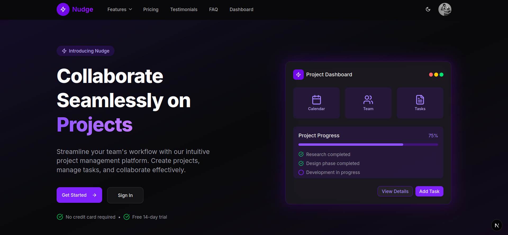
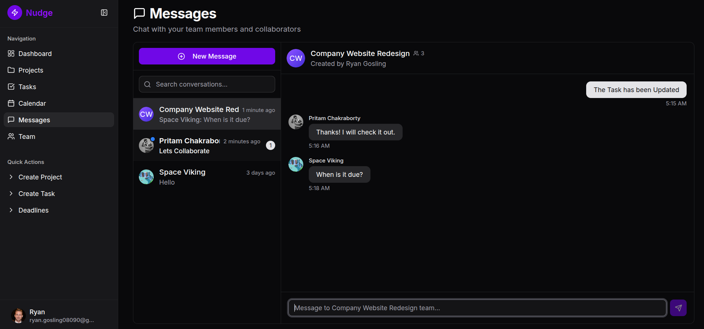
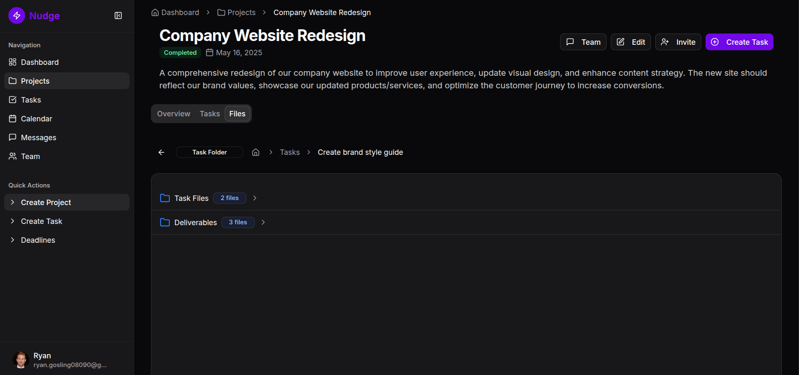
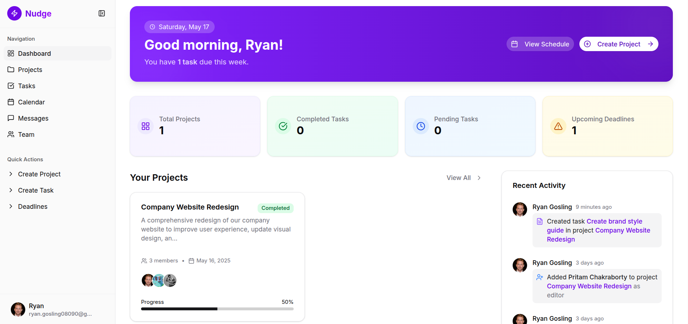

# Nudge - Project Collaboration Platform



## 📋 Overview

Nudge is a sophisticated project collaboration platform designed to streamline team workflows and enhance productivity through intuitive project management tools. This full-stack application provides teams with a centralized workspace to create, track, and complete projects with ease.

**Accounts created with email/password require activation before login. You can sign up with Google or GitHub for instant verification.**

## ✨ Key Features

- **Project Management**: Create, edit, and organize projects
- **Team Collaboration**: Invite team members, assign roles, and track contributions
- **Role-Based Access Control**: Three-tiered permission system (Admin, Editor, Member) for secure collaboration
- **Task Management**: Create, assign, and track tasks with priority levels, due dates, and status tracking
- **Real-time Communication**: Integrated real-time chat system for both direct messaging and team discussions
- **File Management**: Upload, organize, and share files within projects and tasks
- **Comprehensive Dashboard**: Visual overview of projects, tasks, and activities
- **Calendar & Deadlines**: Track important project milestones and deadlines
- **Activity Feed**: Stay updated with recent project activities and changes
- **Kanban Board View**: Drag-and-drop task management with visual workflow stages
- **Responsive Design**: Fully mobile-responsive interface for collaboration on any device



### Auto-Accept Team Invitation

For demo and testing purposes, any invitation sent to "pritam.amit26@gmail.com" to join a project as a member will be automatically accepted.

## 🛠️ Technology Stack

### Frontend

- **Framework**: Next.js 15 with App Router
- **Language**: TypeScript
- **UI**: TailwindCSS with customized UI components
- **Authentication**: NextAuth.js with email/password and social authentication (Google, Github)
- **Form Handling**: React Hook Form with Zod validation
- **File Uploads**: UploadThing integration

### Backend

- **Server**: Node.js with Express
- **Language**: TypeScript
- **Database**: PostgreSQL with Prisma ORM
- **Authentication**: JWT with bcrypt password hashing
- **Real-time Communication**: Socket.IO server
- **Email Service**: Integrated with SendGrid/SMTP for notifications
- **File Storage**: Secure file storage with UploadThing

### DevOps

- **Docker** with multi-container setup
- **Docker Compose** for local development and deployment

## Architecture

Nudge is built on a modern, microservices-oriented architecture:

- **Frontend Container**: Next.js application serving the user interface
- **Backend Container**: Express API providing business logic and data access
- **Database Container**: PostgreSQL instance for persistent storage

The application uses a RESTful API for most operations, with Socket.io for real-time features like messaging and status updates.



## 🚀 Getting Started

### Prerequisites

- Docker and Docker Compose
- Node.js (v18 or higher)
- npm or yarn

### Installation

1. Clone the repository:

```bash
git clone https://github.com/atpritam/project-collab-app.git
cd project-collab-app
```

2. Set up environment variables:

```bash
cp backend/.env.example backend/.env
cp frontend/.env.example frontend/.env
```

3. Start the application with Docker:

```bash
docker-compose up
```

4. Access the application:

- Frontend: http://localhost:3000
- Backend API: http://localhost:4000
- Prisma Studio (database explorer): http://localhost:5555

## Local Development

For local development without Docker:

1. Install dependencies:

   ```bash
   # Frontend
   cd frontend
   npm install

   # Backend
   cd backend
   npm install
   ```

2. Set up the database:

   ```bash
   cd backend
   npx prisma migrate dev
   ```

3. Start the development servers:

   ```bash
   # Frontend
   cd frontend
   npm run dev

   # Backend
   cd backend
   npm run dev
   ```



## 📚 Learning Resources

This project demonstrates several advanced concepts:

- **Next.js App Router**: Modern routing and server components
- **Prisma ORM**: Type-safe database access and migrations
- **Socket.IO**: Real-time bidirectional communication
- **Docker Containerization**: Application isolation and deployment
- **TailwindCSS Components**: Reusable UI components with utility classes

## 🤝 Contribution

This project demonstrates my skills in full-stack development, architecture design, and creating intuitive user experiences. As a portfolio piece, it showcases my ability to build complex systems with modern web technologies.

Contributions are welcome! Please feel free to submit a Pull Request.

1. Fork the repository
2. Create your feature branch (`git checkout -b feature/amazing-feature`)
3. Commit your changes (`git commit -m 'Add some amazing feature'`)
4. Push to the branch (`git push origin feature/amazing-feature`)
5. Open a Pull Request

---

© 2025 Nudge. All rights reserved.
